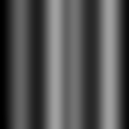

# Questions and Answers <!-- omit in toc -->

The following is a constantly updating question and answer page with common questions posed by students regarding this project. Please check if your question is answered here before seeking other solutions.

## Table of Contents <!-- omit in toc -->
<!-- TOC and section numbers automatically generated, do not manually edit -->
- [1. How do I make a mission?](#1-how-do-i-make-a-mission)
- [2. What is the objective of the mission?](#2-what-is-the-objective-of-the-mission)
- [3. How do I read LiDAR returns from code?](#3-how-do-i-read-lidar-returns-from-code)
  - [3.1. How are LiDAR ranges arranged in the LaserScan topic?](#31-how-are-lidar-ranges-arranged-in-the-laserscan-topic)
- [4. What is the field of view (FoV) of the LiDAR?](#4-what-is-the-field-of-view-fov-of-the-lidar)
- [5. What are the intensity returns from the LiDAR?](#5-what-are-the-intensity-returns-from-the-lidar)
- [6. How do I tell the drone to go in a specific direction?](#6-how-do-i-tell-the-drone-to-go-in-a-specific-direction)
- [7. What is the competition terrain like?](#7-what-is-the-competition-terrain-like)
- [8. What are the kinematic capabilities of the drone we are flying?](#8-what-are-the-kinematic-capabilities-of-the-drone-we-are-flying)
- [9. What is contour flight?](#9-what-is-contour-flight)
- [10. How will my team be scored?](#10-how-will-my-team-be-scored)
- [11. How do I generate the scored metrics?](#11-how-do-i-generate-the-scored-metrics)
  - [11.1. How do I get my time and AGL values?](#111-how-do-i-get-my-time-and-agl-values)
  - [11.2. How do I log my runs in Gazebo?](#112-how-do-i-log-my-runs-in-gazebo)
  - [11.3. How do I make a screen recording of my run for the presentation?](#113-how-do-i-make-a-screen-recording-of-my-run-for-the-presentation)
<!-- TOC and section numbers automatically generated, do not manually edit -->

## 1. How do I make a mission?

The objective for you is to write an altitude selection algorithm, while the rest of the mission logistics are handled for you. To get started, use the [template mission using the mission construct](https://github.com/katabeta/lm-mit-momentum/blob/master/template_mission.py) or the [template mission using the goto_location construct](https://github.com/katabeta/lm-mit-momentum/blob/master/template_goto.py).

If you already have something that's working or would prefer to work something out from scratch, you are welcome to continue using that as it will help with your creativity score.

The mission is written using Python and asyncronous calls to the [MAVSDK library](http://mavsdk-python-docs.s3-website.eu-central-1.amazonaws.com/). Missions are constructed as API calls for the drone to start up, takeoff, complete mission, and land. For examples, check out the [MAVSDK examples](https://github.com/mavlink/MAVSDK-Python/tree/main/examples).

## 2. What is the objective of the mission?

The objective of the mission is to go from start to finish following the AGL value as closely as possible as fast as possible.

Below are the pertitent values to your mission (relative to the origin of the terrain):

- Start (in meters x, y, z): [0, 0, 0]
  - This is where the drone is spawned automatically by PX4
- Finish (in meters x, y, z): [38, 0, 1]
- Target AGL: 3 m

**NOTE:** The AGL tracker plug in will spawn the drone at [0, 0, 0]. If you don't have the AGL tracker setup correctly, PX4 will start your drone slightly offset, which is not correct.

## 3. How do I read LiDAR returns from code?

Gazebo is the software that handles the sensor simulation and is the software that publishes the returns. The internal structure of the communication is implemented using [Protocol Buffers](https://developers.google.com/protocol-buffers) and you can listen for the messages using external software. This is what [Py3Gazebo](https://github.com/katabeta/lm-mit-momentum#8-install-py3gazebo) is for in our case.

If you have successfully installed Py3Gazebo, you should be able to run the file [tutorial/demos/demo_lidar_read.py](https://github.com/katabeta/lm-mit-momentum/blob/master/tutorial/demos/demo_lidar_read.py), which will print out LiDAR readings every 5 seconds for 20 seconds total. You must have PX4 and Gazebo running with the LiDAR model enabled.

To test your knowledge and understanding, please read along the [LaserScan tutorial](https://github.com/katabeta/lm-mit-momentum/blob/master/tutorial/tutorial_lidar.py) and help make it complete. By the end of the tutorial you should be more familiar with:

- Checking and acquiring more information on the published data from Gazebo
- Looking at a "snapshot" from the published data from Gazebo
- The structure of the 'LaserScan' topic
- Iterating through the known output of our 'LaserScan' topic

### 3.1. How are LiDAR ranges arranged in the LaserScan topic?

The LiDAR ranges are returned in a flattened 1D array that has the 20 horizontal ranges superimposed on each other (`[v1h1 .. v20h1 v1h2 .. v20h2 v1h3 .. v20h3 ...]`). The returns are ordered minimum to maximum based on the FoV ranges reported in the LaserScan message. The top vertical ray corresponds to 0 deg, while the one looking straight down corresponds to -90 deg. Similarly, the right half of horizontal returns is negative degrees, the left half is positive degress, and the middle is 0 degs.

Teams should experiment reading the LiDAR while Gazebo is running to convince themselves that they understand the order of the returned ranges.

## 4. What is the field of view (FoV) of the LiDAR?

This LiDAR's FoV is defined as

- Horizontal: -30 to 30 degs, 3 deg increments, 0 degs points directly in front of vehicle
- Vertical: -90 to 0 degs, 10 deg increments, 0 degs points directly in front of vehicle, -90 degs points directly down
- Range: 0.2 m to 10 m, with infinity indicating an unreturned ray

For further information, check out the LiDAR definition in the [models/lidar/model.sdf](https://github.com/katabeta/lm-mit-momentum/blob/master/models/lmlidar/model.sdf) file, within the `<ray>` element.


## 5. What are the intensity returns from the LiDAR?

A typical LiDAR returns an intensity value, which is a measure of the intensity of the returned beam. This means that this return measures the reflectivity of the surface to the wavelength of the beams cast by the LiDAR.

This value is irrelevant for the purposes of this competition.

## 6. How do I tell the drone to go in a specific direction?

You can tell the drone to go to a specific *location* by appending a mission item with the desired location to the mission and uploading the mission to the drone (as in the [mission example](https://github.com/mavlink/MAVSDK-Python/blob/main/examples/mission.py)), or you can use the `drone.action.goto_location` command (as in the [goto example](https://github.com/mavlink/MAVSDK-Python/blob/main/examples/goto.py)). Note that the `goto_location` command does not block while executing and you will not know from code when you have reached the waypoint unless you also monitor your position.

Specifying locations, as opposed to directions of flight, is the preferred way of commanding the drone for this competition.

For more examples, check out the [MAVSDK examples](https://github.com/mavlink/MAVSDK-Python/tree/main/examples).

## 7. What is the competition terrain like?

The competition terrain is a wavy structure with active area dimensions of 40x40 m and a maximum height of 5 m. The terrain is positioned at 0 deg N, 0 deg W, at 0 m altitude. If you don't find that's the case for you, make sure you run `source set_home.sh` in the terminal before launching Gazebo and PX4.

The terrain definition is located in [worlds/models/terrain2d/model.sdf](https://github.com/katabeta/lm-mit-momentum/blob/master/worlds/models/terrain2d/model.sdf) if you seek further information.

**NOTE:** The heights in the terrain are defined by a heightmap. If the terrain you are working with does not match what is defined by the heightmap, make sure that you have pulled from this git repository and ran the setup script again. The terrain heightmap looks like this (black = 0m, white = 5m):



## 8. What are the kinematic capabilities of the drone we are flying?

The drone has a [default set of parameters with default values](https://dev.px4.io/master/en/advanced/parameter_reference.html).

The following are pertinent to this competition:

- Max horizontal velocity: 12 m/s
- Max ascent velocity: 3 m/s
- Max descent velocity: 1 m/s

## 9. What is contour flight?

Countour flight is a type of terrain flight, where the aircraft is flying near terrain in order perform surveillance, survey, avoid detection or other reasons. In addition to contour flight, terrain flight also includes low-level flight, and Nap of the Earth (NOE) flight. The following is a brief explanation of each type, in decreasing order of distance to the ground and increasing order of pilot workload.

- Low-level flight: flight low to the ground where the aircraft is holding a steady airspeed and altitude
- Contour flight: constant airspeed flight that flies close to the ground and varies altitude to match the terrain
- Nap of the Earth: flight that attempts to stay extremely close to the ground by varying both airspeed and altitude to match the terrain relief

Your goal is to implement contour flight, so you will have to maneuver the drone to follow the terrain relief, but try to maintain a constant airspeed.

The altitudes at which these modes of flight are performed is dependent on vehicle capabilities, weather conditions, pilot workload, and any number of other conditions. For the purposes of this competition, you will perform your contour flight as close to the terrain as possible while not colliding with it.

For further reading on terrain flight, reference this [article](https://ianrp.org/terrain-flight/) by the International Association of Natural Resource Pilots.

## 10. How will my team be scored?

Teams will be ranked based on their performance in three areas: time, accuracy of AGL tracking, and a judge's score. A team's total score is determined by $sum(rank(time) + rank(AGL) + average(judge's\ score))$.

The judges score will consist of (but is not limited to):

- Creativity
- Teamwork
- Presentation
- Customer satisfaction (e.g. reliability, testability, etc.)

The only metric that will be scored live is the judge's score. For the other two, teams will submit their times and averages as reported by the AGL tracker Gazebo plugin (***still WIP***). Teams should follow the instructions in section [How do I generate the scored metrics?](#11-how-do-i-generate-the-scored-metrics) for submitting these items.

**For the presentation only**, teams will also be required to create a video showcasing their strategy and results. This video will be shown during the team's presentation. The teams are free to structure their presentation as they see fit, but we recommend that teams use this reel to aid the team in showcasing their strategy and in talking about their development process. As such, this reel does not have to show the entire flight. This video will be uploaded to YouTube and the link will be submitted with the times and averages.

## 11. How do I generate the scored metrics?

### 11.1. How do I get my time and AGL values?

You will use the provided AGL tracker Gazebo plugin (***still WIP***). This plugin launches with Gazebo when you run the `make px4_sitl gazebo___terrain2d` command.

The tracker plugin and detailed instructions on how to access the values recorded by it will be available NLT 25 JAN, but you can expect the plugin to print to console the AGL values and time, and these prints will be saved to a log file. One member from each team will have to submit the following items by sending an email to momentum.scores@gmail.com. Format the email like this:

Subject: *Team #: team_name*

Body:

- AGL score
- Time score
- Reel video

Attached:

- Log of prints output from plugin, renamed to the format `<team_name>_<team_#>_plugin.log`
- Gazebo log, remaned to the format `<team_name>_<team_#>_gazebo.log`

Once the tracker is provided, to check if it is running, you should see `Loading AGL Tracker Plugin...` when launching PX4 with gazebo in the status messages in the terminal. If you do not have it running, make sure that you follow the instructions provided in the [plugin folder](https://github.com/katabeta/lm-mit-momentum/tree/master/plugin).

### 11.2. How do I log my runs in Gazebo?

You can use the command line utility `gz log` to record a log in Gazebo.

In order to start recording, you have to have Gazebo running and you have to have an available terminal window. Below are the commands you will need to start, stop, and playback your log.

``` sh
# Start recording
gz log -d 1
```

*Do your mission here.*

``` sh
# Stop recording
gz log -d 0
```

``` sh
# Playback your recording - note that your log directory may look different
gazebo -p ~/.gazebo/log/<timestamped folder>/gzserver/state.log
```

For more information, refer to Gazebo documentation on [logging utilities](http://gazebosim.org/tutorials?tut=log_filtering&cat=tools_utilities) and [log playback](http://gazebosim.org/tutorials?tut=logging_playback).

### 11.3. How do I make a screen recording of my run for the presentation?

If you wish to record from Ubuntu, perform the following terminal command in order to increase the timeout on screencapture.

``` sh
gsettings set org.gnome.settings-daemon.plugins.media-keys max-screencast-length 1800
```

To start the recording, press `ctrl+shift+alt+R`. Press this key combo again to stop the recording. The video in `.webm` format will be located in your Videos folder.

If you wish to screen record from a different operating system while in a remote terminal, please find instructions for [MacOS](https://support.apple.com/en-us/HT208721) and [Windows10](https://www.laptopmag.com/articles/how-to-video-screen-capture-windows-10).
